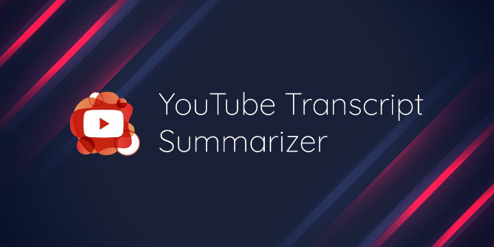

# YOUTUBE-TRANSCRIPT-SUMMARIZER




## Project Overview
This project is an integration of web development and the very emerging technology, Machine Learning. This Project aims to provide summarized content of a video in the form of transcripts by keeping all the important points and making it short and easily understandable. This will be useful in getting the summary of several lecture videos easily. The summarized text can also be downloaded easily.The issue with the content on youtube is that there’s a lot of it. So to resolve this issue, there should be a tool which can provide a summarization of the video and therefore saves time.

## Problem and Solution Statement
Enormous number of video recordings are being created and shared on the YouTube throughout the day. It becomes really difficult to spend time in watching such videos which may have a longer duration than expected and sometimes our efforts may become futile if we aren’t able to find relevant information out of it. Summarizing transcripts of such videos will allows us to quickly look out for the important patterns in the video and helps us to save time and efforts to go through the whole content of the video.

## Implementation strategy
So basically, this is a chrome extension, having an option to copy to the current URL of the video being selected. After providing the link, it will access the transcript of the particular audio using the YouTube transcript API and then the transcript will be provided to a machine learning model that will in return provide the summarized text of the transcript. The summarized text would be downloadable by the user.

## Contributing
Pull requests are welcome. For major changes, please open an issue first to discuss what you would like to change.

Please make sure to update tests as appropriate.


## Features

- Multiple Language available (English, Hindi, Braille)
- Runtime Text to Speech Conversion (English language Only)
- Get Transcripts of videos of any length.
- Get Summarization of video of any language.
- Downloadable Transcripts.


## Installation

1. Clone the repository in your local machine:-
```
git clone https://github.com/Zen-o-Droid/YOUTUBE-TRANSCRIPT-SUMMARIZER.git
```

2. To run the API, first set up a **Virtual Environment**. In order to do so, go into *youtube-transcript-summarizer-api* folder, open command prompt and paste the following command:-
```
python -m venv venv
```

3. After successfully setting up the Virtual Environment, it's time to install the **Dependencies**. Use the following command:-  
```
pip install -r requirements.txt
```

4. Now it's time to run the **API**:-
```
python app.py
```

5. Now the API is set up to provide the response. It's time to start with **frontend**. 


6. Go into *youtube-transcript-summarizer-frontend* folder by opening a new terminal and paste the following command:-
```
cd youtube-transcript-summarizer-frontend
```

7. Install all the required **node modules** with:-
```
npm install
```

8. Now you are all set to run the frontend.
```
npm start
```


## Authors

- [@Yogesh Kumar Singh](https://www.github.com/Zen-o-Droid)
- [@Shruti Singh](https://www.github.com/Shruti0999)
- [@Richa Sinha](https://www.github.com/Richa710)
